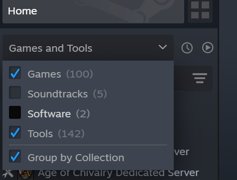
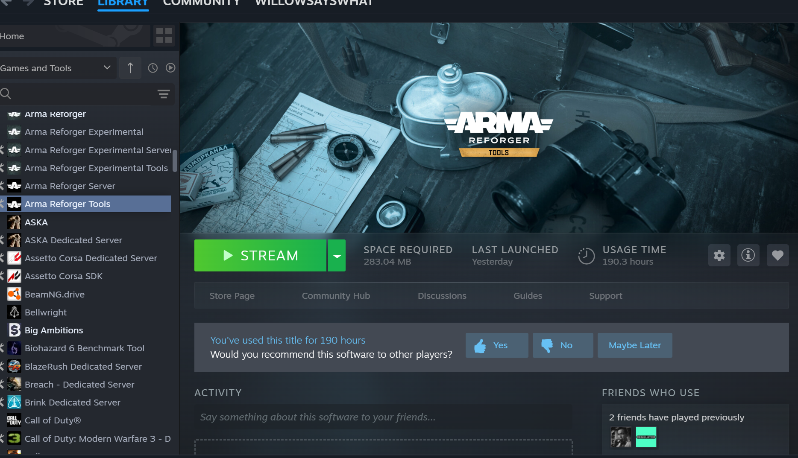

# Install The Enfusion Workbench
To install the game, tick this box on your steam library and find Arma Reforger Tool.

Once finished, you will have the Enfusion Workbench icon on your desktop.

Having the game installed will allow the workbench to run the game and this will also allow you to download mods from the game via the in-game workshop and further modify them.

[return to Main](/README.md)